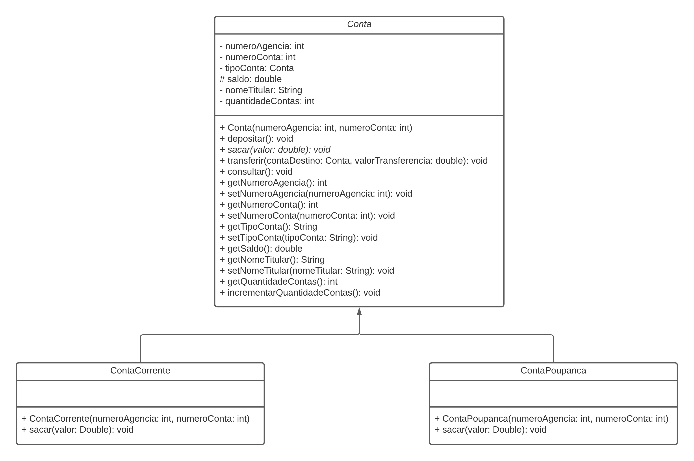
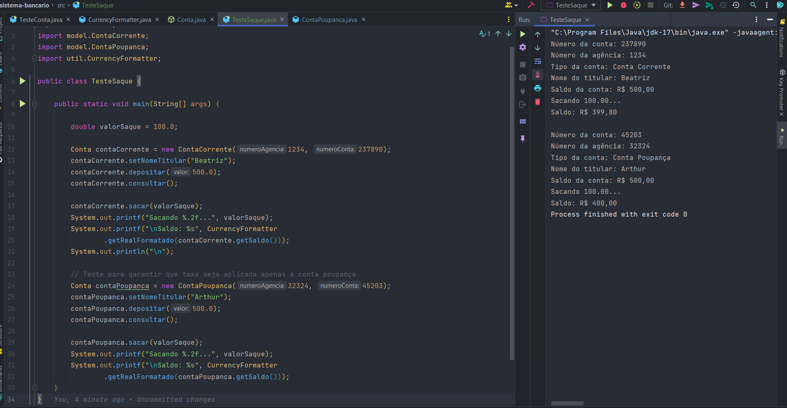

# Projeto N3 - Sistema bancário

Projeto N3 - Projeto de um sistema bancário para a prática de OOP da Fatec São Caetano do Sul de disciplina Técnicas Avançadas de Programação

## Primeiro Entregável - 28/10

O sistema possui 2 tipos de conta: Conta Corrente e Conta Poupança. Para isso, faz necessário uso de uma classe abstrata Conta e duas classes filhas,
ContaCorrente e Conta Poupanca. as regras de negócio estão majoritariamente na superclasse, visto que são muito similares para os dois tipos de conta, no 
entanto, o tipo de conta é definido nos construtores das subclasses. A quantidade de contas é incrementado após instanciação de um objeto de alguma subclasse
de Conta. A variável estática da classe Conta armazena a quantidade de contas do programa e incrementa com a instaciação de objetos de 
subclasses da classe Conta. Além disso, uma classe opcional foi adicionada para formatação de valores monetários através de um método público e estático.

### Diagrama de classes

### Classe de Teste

## Segundo Entregável - 04/11

Uma regra de negócio determina que o saque para conta corrente tenha uma taxa de R$0,20. Para isso, o método sacar da classe Conta foi definido como abstrato com implementação foi feita em suas subclasses e o atributo saldo foi definido como protected para que possa ser acessado por suas sublclasses.

### Diagrama de classes

### Classe de Teste

